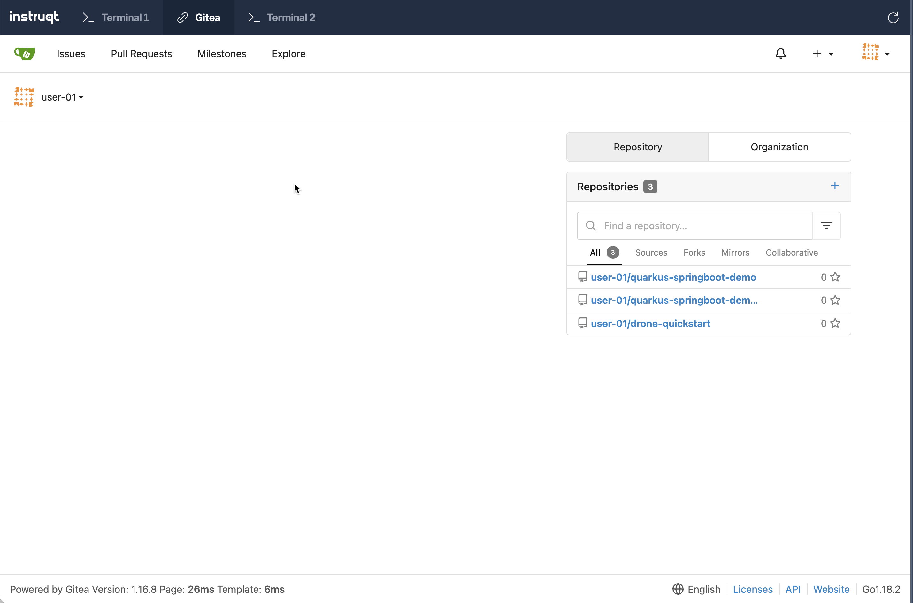

👋 Introduction
===============

Ensure all required environment variables are set,

```shell
direnv allow .
```

Add Gitea helm charts,

```shell
helm repo add gitea-charts https://dl.gitea.io/charts/
helm repo update
```

Use the helm to deploy Gitea:

```shell
envsubst < "$DAG_HOME/helm_vars/gitea/values.yaml" | helm upgrade \
  --install gitea gitea-charts/gitea \
  --values - \
  --wait
```

👤 Add Gitea Users
==================

Gitea is configured with a default admin,

Username: ```demo```
Password: ```demo@123```

But for all the challenges we will be using the user `user-01`. The user by default will be configured with the following repositories,

- <https://github.com/kameshsampath/dag-stack>
- <https://github.com/kameshsampath/drone-quickstart>
- <https://github.com/kameshsampath/quarkus-springboot-demo>
- <https://github.com/kameshsampath/quarkus-springboot-demo-gitops>

Run the following command to create `user-01` and configure the user with the repositories listed above.

```shell
kustomize build "$DAG_HOME/k8s/gitea-config" \
  | envsubst | kubectl apply -f -
```

Wait for the job to complete before proceeding further,

```shell
kubectl wait --for=condition=complete --timeout=120s -n drone job/workshop-setup
```

Now you can login to Gitea using Gitea tab using the user `user-01` and password `user-01@123`,



Rename the existing remote to be `upstream`

```shell
git remote rename origin upstream
```

Add new remote to called `origin` to with url set to `${GITEA_URL}/user-01/dag-stack.git`

```shell
git remote add origin "${GITEA_DAG_REPO}"
```

Listing the git remotes,

```shell
git remote -v
```

```text
origin  ${GITEA_URL}/user-01/dag-stack.git (fetch)
origin  ${GITEA_URL}/user-01/dag-stack.git (push)
upstream        https://github.com/kameshsampath/dag-stack.git (fetch)
upstream        https://github.com/kameshsampath/dag-stack.git (push)
```

Push the current "${DAG_TARGET_VERSION}" branch to `origin`

```shell
git push origin "${DAG_TARGET_VERSION}"
```

🏁 Finish
=========

To complete this challenge, press **Check**.
