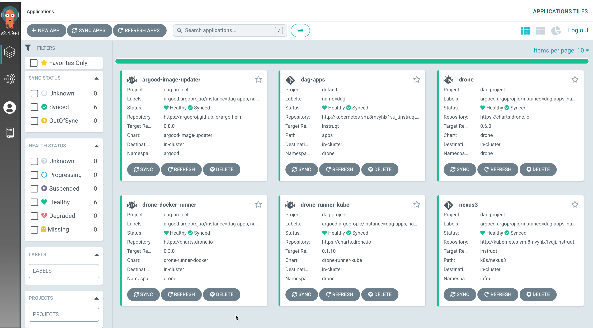
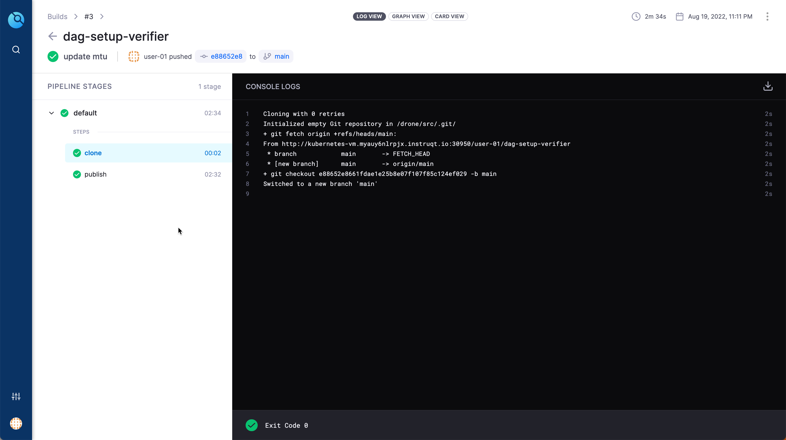

👋 Introduction
===============

To do GitOps we will be using [Argo CD](https://argo-cd.readthedocs.io/en/stable/user-guide/projects/).

Ensure Environment
===================

Ensure all required environment variables are set,

```shell
direnv allow .
```

🐙 Deploy Argo CD
=================

Add Argo CD helm charts,

```shell
helm repo add argo https://argoproj.github.io/argo-helm
helm repo update
```

Use the helm to deploy Argo CD,

```shell
envsubst < $DAG_HOME/helm_vars/argocd/values.yaml |\
  helm upgrade --install argocd argo/argo-cd \
    --create-namespace \
    --namespace=argocd \
    --values - \
    --wait
```

You can access Argo CD using the Argo CD tab. The default admin username is `admin` and password has been set to `demo@123`.

🔥 Cluster Bootstrapping
========================

The cluster bootstrapping installs the core DAG stack applications ([App of Apps](https://argo-cd.readthedocs.io/en/stable/operator-manual/declarative-setup/#app-of-apps)) and DAG stack has the following child applications,

- Argo CD Image Updater
- Drone Server
- Droner Runners
- Artifactory as Maven Repository Manager

Few environment variables that use to bootstrap as shown below, they are already set in your shell via `$DAG_HOME/.envrc`,

```shell
export GITEA_DOMAIN="kubernetes-vm.${DAG_BASE_DOMAIN}"
export GITEA_URL="http://${GITEA_DOMAIN}:30950"
export DRONE_SERVER_HOST="kubernetes-vm.$DAG_BASE_DOMAIN:30980"
export DRONE_SERVER_URL="http://${DRONE_SERVER_HOST}"
export GITEA_USER=user-01
```

<!-- Verify we have the `${GITEA_HTTP_CLUSTER_IP}` variable set,

```shell
echo "${GITEA_HTTP_CLUSTER_IP}"
```

The cluster `${GITEA_HTTP_CLUSTER_IP}` should point to the `gitea-http` service cluster ip,

```shell
kubectl get svc -n default gitea-http
``` -->

Create Argo Apps
================

Update the DAG App `$DAG_HOME/helm_vars/dag/values.yaml` with values matching to the environment.

As we already got the required environment variables set, lets get them updated on the helm values,

```shell
envsubst < "$DAG_HOME/helm_vars/dag/values.tpl.yaml" > "$DAG_HOME/helm_vars/dag/values.yaml"
```

Commit and push the code to `${GITEA_DAG_REPO}`, so that values will be used by the DAG apps Argo CD application that values can be used by Argo Apps in upcoming sections.

```shell
git add "$DAG_HOME/helm_vars/dag/values.yaml"
git commit -m "Deploy DAG App of Apps" "$DAG_HOME/helm_vars/dag/values.yaml"
#TODO shall we make this as main branch in Gitea for workshop??
git push origin instruqt
```

Create DAG App on ArgoCD,

```shell
envsubst < "$DAG_HOME/k8s/dag/app.yaml" | kubectl apply -f -
```

Login to Argo server via cli,

```shell
argocd login "${ARGOCD_SERVER_HOST}" --plaintext --insecure --username admin --password='demo@123'
```

Trigger app sync

```shell
argocd app sync dag-apps
```

**NOTE**: The sync operation will take few minutes

A successful Argo CD deployment of apps should look as shown below,



Validate Drone Setup
====================

What we have done until now,

- Setup Gitea
- Setup `dag-apps` Argo CD that in turn setup
  - Drone Server
  - Drone Kube Runner

Add Drone Admin User
====================

Copy the account settings named `Example CLI Usage` from the Drone Account Settings page and update the `$DAG_HOME/.envrc`.



Create a new file called `.envrc.local` and add the following variables to it,

```shell
export DRONE_SERVER="drone server as listed in the drone account settings page"
export DRONE_TOKEN="token from the drone account settings page"
```

Ensure to reload the updates,

```shell
direnv allow .
```

Run the drone command to verify we are able to use drone cli,

```shell
drone info
```

The command above fails with `Unauthorised` message.

Update the DAG App `$DAG_HOME/helm_vars/dag/values.yaml` with values matching to the environment,

```shell
export ENABLE_DRONE_ADMIN=true
envsubst < $DAG_HOME/helm_vars/dag/values.tpl.yaml > $DAG_HOME/helm_vars/dag/values.yaml
```

In few seconds you could see Argo CD rollout update to `drone`. Running drone info again should display `user-01` and the email of the user `user-01@example.com`.

```shell
drone info
```

🏁 Finish
=========

To complete this challenge, press **Check**.
