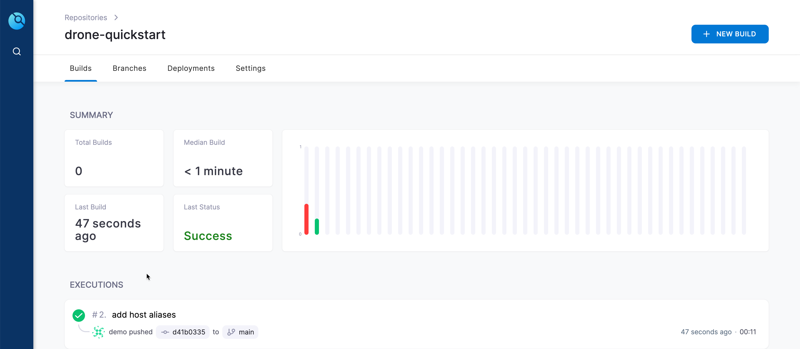

Deploy Drone Quickstart App
===========================

Activating a repo in drone makes Drone to run the CI on the git project on git events.

To activate the `dag-setup-verifier` repo in drone, run the following command

```shell
drone repo enable user-01/dag-setup-verifier
```

Navigate to the git repositories home directory i.e. `$GIT_REPOS_HOME` using **Terminal 1** tab,

```shell
cd $GIT_REPOS_HOME
```

```shell
git clone http://kubernetes-vm.${_SANDBOX_ID}.instruqt.io:30950/user-01/dag-setup-verifier.git
cd dag-setup-verifier
```

Use the `instruqt` branch,

```shell
git checkout instruqt
```

Edit the `.envrc.local` file to match your settings,

```shell
export DRONE_SERVER=http://kubernetes-vm.${_SANDBOX_ID}.instruqt.io:30980
export DRONE_TOKEN="your drone token from drone account settings page"
```

> **TIP**: You can copy the `.envrc.local` from `$GIT_REPOS_HOME/dag-stack.git`, as we have already copied the token from drone account settings page.
> ```shell
> cp $GIT_REPOS_HOME/dag-stack/.envrc.local .
> ```

```shell
direnv allow .
```

Ensure our drone token works,

```shell
drone info
```

Edit `.drone.yml` using the **Code** tab, ensure that `.drone.yml` updated to be like,

```yaml
---
kind: pipeline
type: kubernetes
name: default

# update this if you want to do arm64 build
platform:
  os: linux
  arch: amd64

# Trigger only main
trigger:
  branch:
  - instruqt

steps:

  - name: publish
    image: plugins/docker:20.13
    pull: if-not-exists
    settings:
      tags: "latest"
      dockerfile: docker/Dockerfile.linux.arm64
      insecure: true
      mtu: 1410
      build_args:
        - "MAVEN_REPOS=nexus=http://nexus.infra:8081/repository/maven-public/"
      username:
        from_secret: image_registry_user
      password:
        from_secret: image_registry_password
      registry:
        from_secret: image_registry
      repo:
        from_secret: destination_image
```

Add Secrets to Drone Repository
-------------------------------

As you notice we have `from_secrets` attributes in the `.drone.yml`.  Those are loaded using `drone_secrets`.

Drone secrets are added using the `drone secret add` command, for e.g. to add the secret called `destination_image`,

```shell
drone secret add --name destination_image --data "${REGISTRY_NAME}/example/dag-setup-verifier" "${DRONE_GIT_REPO}"
```

Run the following commands to add other secrets to the `dag-setup-verifier` repo,

```shell

drone secret add --name image_registry --data "${REGISTRY_NAME}" "${DRONE_GIT_REPO}"

drone secret add --name image_registry_user --data "${IMAGE_REGISTRY_USER}" "${DRONE_GIT_REPO}"

drone secret add --name image_registry_password --data "${IMAGE_REGISTRY_PASSWORD}" "${DRONE_GIT_REPO}"
```

> **TIP**: You can also use the scripts from `$DAG_HOME/work/dag-setup-verifier/scripts/add-secrets.sh`.

Make sure the `mtu` value for the Docker plugin is set to right value in as per the environment,

```shell
ifconfig | grep cni
```

The command should show an output like,

```shell
cni0: flags=4163<UP,BROADCAST,RUNNING,MULTICAST>  mtu 1410
```

Update the value as per the `mtu` value shown in the output of the command.

Commit and push the code to see the build trigger,

```shell
git commit --allow-empty -m "Verify Setup" -m "Verify Setup"
git push origin instruqt
```

Check the build status in the Drone Dashboard,



🏁 Finish
=========
**Congratulations**!!! You are now a GitOpsian. Add other projects of yours and keep rocking with Drone CI and Argo CD.

Few applications that you can try with this stack,

- <https://github.com/kameshsampath/quarkus-springboot-demo-gitops>
- MERNStack

To complete this challenge, press **Check**.
